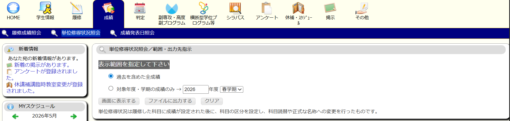
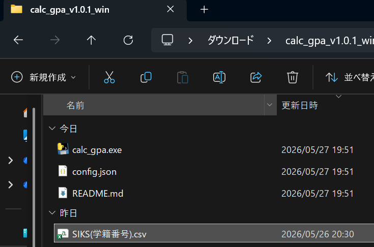

# 大阪大学 理学部 物理学科 単位・GPA計算ツール

大阪大学の学生向けに、KOANからダウンロードした成績データを用いて、卒業要件の達成状況と、研究室配属等で参照されるGPAを詳細に計算する非公式ツールです。

## 特徴
- **高精度**: KOANの「成績紹介」CSV（SIKSファイル）に対応し、正確な単位数と区分で計算します。
- **便覧準拠**: 令和6年度の学生便覧の区分（教養、国際性、専門、自由選択など）に則って集計します。
- **プライバシー配慮**: **ネットワーク通信を一切行いません。** 成績データはあなたのPC内でのみ処理され、外部に送信されることはありません。
- **オープンソース**: プログラムの仕組み（ソースコード）をすべて公開しているため、誰でも安全性を確認できます。

## 使い方 (一般windowsユーザー)

### 1. データのダウンロード
KOANにログインし、「成績」→「単位修得状況照会」画面を開きます。
「表示範囲を指定して下さい」で **「過去を含めた全成績」** を選択し、**「ファイルに出力する」** ボタンを押してCSVファイルをダウンロードしてください。



※ ファイル名は `SIKS` で始まるもの（例: `SIKS04B24005.csv`）であることを確認してください。

### 2. 実行ファイルの入手
GitHubの [Releases](https://github.com/AaA-11-1011/CALC_GPA/releases) から最新の `calc_gpa_vX.X.X_win.zip` をダウンロードし、解凍します。(Windows11なら右クリ->すべて展開)

### 3. ファイルの配置
解凍したフォルダの中に、手順1でダウンロードした `SIKS*.csv` を入れます。
※ `calc_gpa.exe` と同じ場所に置いてください。



### 4. 実行
`calc_gpa.exe` をダブルクリックします。

> **⚠️ Windowsの警告が出た場合**
> 個人開発のツールであるため、実行時に「WindowsによってPCが保護されました」という警告が出ることがあります。
> 1. **「詳細情報」** をクリック
> 2. **「実行」** ボタンをクリック
> 
> 以上の操作で実行いただけます。中身はソースコードとして公開されており、安全です。

### 5. 結果の確認
画面に結果が表示されるほか、フォルダ内に `gpa_result.txt`（詳細レポート）が保存されます。


## .exeを使わない使い方(macなど)(pythonインストール必要)
リポジトリごとコピーして
```
python3 src/calc_gpa.py
```

---

## プログラム全体の構造

このプログラムは、メンテナンス性を高めるため、以下の3層構造で設計されています。

### 1. 設定ファイル (Brain): `config.json`
「どの区分に何単位必要か」「どの科目が必修か」というルールを管理します。便覧の改訂にも柔軟に対応可能です。

### 2. 実行プログラム (Engine): `calc_gpa.py`
CSVデータを読み込み、文字の正規化、カテゴリ判定、単位集計、GPA算出を自動で行います。

### 3. 入力データ (Input): `SIKS*.csv`
大学公式の成績データです。正確な単位数が含まれているため、最高精度の計算が可能です。

---

## 免責事項
*   このツールは非公式なものです。計算結果は独自集計に基づく参考値であり、正確な卒業判定や配属基準については、必ず自身の入学年度の「学生便覧」およびKOANの公式表示を確認してください。
*   このツールを使用したことによるいかなる不利益についても、制作者は責任を負いません。

## ライセンス
[MIT License](LICENSE)

